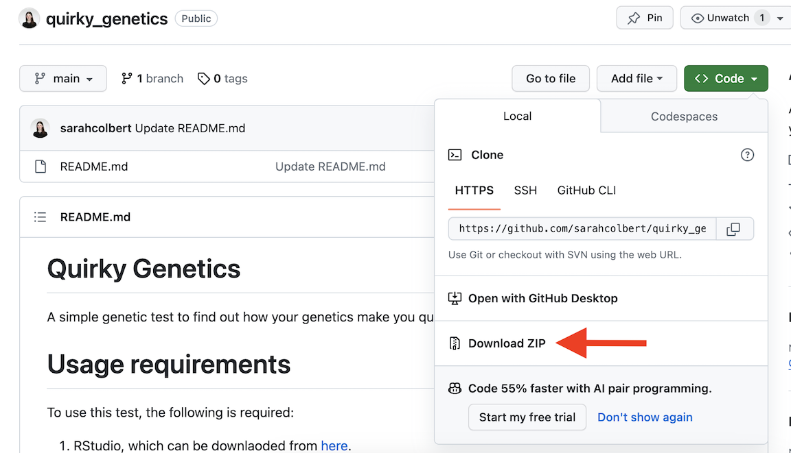

# Quirky Genetics
A simple genetic test to find out how your genetics make you quirky!

# Usage requirements
To use this test, the following is required:
1. RStudio, which can be downlaoded from [here](https://posit.co/download/rstudio-desktop/).
2. You will also need the following R packages:
   - data.table
   - tidyr
   - dplyr
These can be installed by opening RStudio and running the following code:
```
install.packages("data.table")
install.packages("tidyr")
install.packages("dplyr")
```
3. Your WGS data in the form of a vcf file containing only your single sample, which should look something like:

```
##fileformat=VCFv4.2
##FILTER=<ID=PASS,Description="All filters passed">
##FILTER=<ID=RefCall,Description="Genotyping model thinks this site is reference.">
##FILTER=<ID=LowQual,Description="Confidence in this variant being real is below calling threshold.">
##reference=hg38
##INFO=<ID=END,Number=1,Type=Integer,Description="End position (for use with symbolic alleles)">
##FORMAT=<ID=GT,Number=1,Type=String,Description="Genotype">
##FORMAT=<ID=GQ,Number=1,Type=Integer,Description="Conditional genotype quality">
##FORMAT=<ID=DP,Number=1,Type=Integer,Description="Read depth">
##FORMAT=<ID=MIN_DP,Number=1,Type=Integer,Description="Minimum DP observed within the GVCF block.">
##FORMAT=<ID=AD,Number=R,Type=Integer,Description="Read depth for each allele">
##FORMAT=<ID=VAF,Number=A,Type=Float,Description="Variant allele fractions.">
##FORMAT=<ID=PL,Number=G,Type=Integer,Description="Phred-scaled genotype likelihoods rounded to the closest integer">
##DeepVariant_version=1.1.0
##contig=<ID=chr1,length=248956422>
...
##contig=<ID=chr22,length=50818468>
##contig=<ID=chrX,length=156040895>
##contig=<ID=chrY,length=57227415>
##contig=<ID=chrM,length=16569>
#CHROM  POS     ID      REF     ALT     QUAL    FILTER  INFO    FORMAT  PAPG-10
chr1    10108   .       C       CA      0       Pass    .       GT:GQ:DP:AD:VAF:PL      0/1:23:261:207,16:0.0613027:0,27,25
chr1    10146   .       AC      A       0.1     RefCall .       GT:GQ:DP:AD:VAF:PL      ./.:16:98:78,14:0.142857:0,20,17
chr1    10177   .       A       AC      0       RefCall .       GT:GQ:DP:AD:VAF:PL      0/0:32:76:59,7:0.0921053:0,33,36
chr1    10230   .       AC      A       0       RefCall .       GT:GQ:DP:AD:VAF:PL      0/0:24:95:79,15:0.157895:0,25,31
chr1    15274   .       A       G,T     3.4     PASS    .       GT:GQ:DP:AD:VAF:PL      0/2:5:7:0,4,3:0.571429,0.428571:34,21,4,21,0,16
```

# How to use this test
Please download this entire github reposority to your local computer. To do so:
1. Navigate to the main page of the repository: [https://github.com/sarahcolbert/quirky_genetics](https://github.com/sarahcolbert/quirky_genetics)
2. At the top of the files, click on the blue "<> Code" button.
3. Click "Download ZIP"

4. Once downloaded, click on the "quirky_genetics-main.zip" file to decompress it. <br /> 
  
<br />  
The entire test will run via the RMarkdown script. To do so: 
1. Click on the "quirky_genetics.Rmd" file, which will open in Rstudio.
2. Once in Rstudio, navigate to line 18 and replace "/path/to/toy.vcf" with the path and filename for your vcf.

3. Now you're ready to run the test! Click "Knit", then select "Knit to HTML" and your results will begin generating.

4. A file with your results should be generated which looks something like:


