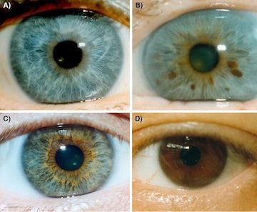

# General information
This genetic test aims to provide you with some fun information about how your genetics may contribute to some of your own quirky traits. Important note: the majority of these traits are complex and affected by multiple variants and the environment, thus the results of this test should not be interpreted to be 100% deterministic. 

## User requirements: uploading your data

To run this Rmarkdown file and get your test results, all you need to do is provide your own vcf file! To do so, please replace the "/path/to/toy.vcf" string with the path and filename for your vcf. Please do not make any other changes to the document. 

```{r, include=FALSE, echo=FALSE}
## put filename and location here 
my_vcf_file <- "/path/to/toy.vcf"
```

```{r setup, include = FALSE, echo = FALSE}
knitr::opts_chunk$set(echo = TRUE)
library(data.table)
library(dplyr)
library(tidyr)
```

```{r, include = FALSE, echo = FALSE}
## make table with variants of interest
vois <- data.frame(matrix(ncol = 4, nrow = 0))

#provide column names
colnames(vois) <- c('rsid', 'CHROM', 'POS', 'TRAIT')

## add variants
vois[nrow(vois) + 1,] <- list("rs11031006", "chr11", 30204981,'Dizygotic Twins')
vois[nrow(vois) + 1,] <- list("rs17293443", "chr15", 67145525,'Dizygotic Twins')
vois[nrow(vois) + 1,] <- list("rs12913832", "chr15", 28120472,'Eye Color')
vois[nrow(vois) + 1,] <- list("rs17822931", "chr16", 48224287,'Ear Wax')
vois[nrow(vois) + 1,] <- list('rs73598374','chr20',44651586,'Deep Sleeper')
vois[nrow(vois) + 1,] <- list('rs3923809',"chr6", 38473194, 'Sleep Movement')
vois[nrow(vois) + 1,] <- list('rs1815739',"chr11",66560624,'Muscle composition')
vois[nrow(vois) + 1,] <- list('rs4481887',"chr1",248333561,'Asparagus urine smell')
vois[nrow(vois) + 1,] <- list('rs671',"chr12",111803962,'Alcohol Flush')
vois[nrow(vois) + 1,] <- list('rs713598',"chr7",141973545,'Bitter Taste')
vois[nrow(vois) + 1,] <- list('rs2937573',"chr5",167044193,'Misophonia')
vois[nrow(vois) + 1,] <- list('rs145946881',"chr2",135851176,'Lactose')
vois[nrow(vois) + 1,] <- list('rs869051967',"chr2",135851175,'Lactose')
vois[nrow(vois) + 1,] <- list('rs41380347',"chr2",135851081,'Lactose')
vois[nrow(vois) + 1,] <- list('rs4988235',"chr2",135851076,'Lactose')
vois[nrow(vois) + 1,] <- list('rs41525747',"chr2",135851073,'Lactose')
vois[nrow(vois) + 1,] <- list('rs8065080', 'chr17', 3577153,'Spice')
vois[nrow(vois) + 1,] <- list("rs10427255", "chr2",145367955, 'Achoo syndrome')
vois[nrow(vois) + 1,] <- list("rs11856995", "chr15",95782414, 'Achoo syndrome')
vois[nrow(vois) + 1,] <- list("rs236514", "chr11",70177590)
```

```{r, include=FALSE, echo=FALSE}
## read in the vcf file
raw_vcf <- fread(my_vcf_file, skip = "CHROM") %>% 
  rename("CHROM" = "#CHROM") %>% ## rename column
  inner_join(vois, by = c('CHROM', 'POS')) %>% ## pull data for just variants we need, this will make table smaller and easier to work with
  select(-c(ID, QUAL, INFO)) ## remove some columns to also make it smaller
```


```{r, include=FALSE, echo=FALSE}
## clean the vcf

## get sample name
samp_name <- names(raw_vcf)[7]

## split up data in the sample column to get genotype, also remove variants with missing calls 
vcf1 <- raw_vcf %>% separate(samp_name, "GT", sep = ":", extra = "drop") %>% filter(GT!="./.") %>% separate(GT, c("GT1", "GT2"),sep = "/")

## make multiple columns for each alternate allele
vcf2 <- vcf1 %>% separate(ALT, c("ALT1", "ALT2", "ALT3", "ALT4"), sep = ",", fill = "right") 

## make columns that annotate sample's alleles
vcf2$A1 <- case_when(
  vcf2$GT1 == "." ~ "missing",
  vcf2$GT1 == "0" ~ vcf2$REF,
  vcf2$GT1 == "1" ~ vcf2$ALT1,
  vcf2$GT1 == "2" ~ vcf2$ALT2,
  vcf2$GT1 == "3" ~ vcf2$ALT3,
  vcf2$GT1 == "4" ~ vcf2$ALT4,
  TRUE ~ "idk"  # Default case if none of the above conditions are met
)
vcf2$A2 <- case_when(
  vcf2$GT2 == "." ~ "missing",
  vcf2$GT2 == "0" ~ vcf2$REF,
  vcf2$GT2 == "1" ~ vcf2$ALT1,
  vcf2$GT2 == "2" ~ vcf2$ALT2,
  vcf2$GT2 == "3" ~ vcf2$ALT3,
  vcf2$GT2 == "4" ~ vcf2$ALT4,
  TRUE ~ "idk"  # Default case if none of the above conditions are met
)
```

## Dizygotic Twinning

There is evidence to suggest a role for two common variants in whether or not someone assigned female at birth will birth dizygotic twins ([Mbarek et al. 2016](https://www.cell.com/ajhg/fulltext/S0002-9297(16)30043-X)). One variant near the *FSHB* gene on chromosome 11 (rs11031006) increases the probability by 18% for each copy of the G allele an individual has, while the other chromosome 15 variant (rs17293443) in the *SMAD3* gene increases the probability by 9% for each copy of the C allele an individual has.

```{r, echo=FALSE, results='asis'}
## if variants are completely missing from vcf 
if (!("rs11031006" %in% vcf2$rsid) & !("rs17293443" %in% vcf2$rsid)) {
cat("<h4 style='color: red;'> Sorry, both variants are missing in the vcf file. Increased risk for dizygotic twinning in the sample could not be determined. </h4>")
}

## if only have one variant
if (!("rs11031006" %in% vcf2$rsid) & ("rs17293443" %in% vcf2$rsid)) {
cat("<h4 style='color: green;'> Only one variant present in the vcf file, using rs17293443 to assess risk... </h4>")
  snp1_a1 <- vcf2[which(vcf2$rsid=="rs17293443"),]$A1
  snp1_a2 <- vcf2[which(vcf2$rsid=="rs17293443"),]$A2
  if(snp1_a1=="C" & snp1_a2=="C"){
  cat("<h4> You have two C alleles at rs17293443 and therefore are at increased risk for birthing dizygotic twins! </h4>")  
  }
  if((snp1_a1=="C" & snp1_a2!="C") | (snp1_a1!="C" & snp1_a2=="C")){
  cat("<h4> You have one C allele at rs17293443 and therefore are at increased risk for birthing dizygotic twins! </h4>")  
  }
  if(snp1_a1!="C" & snp1_a2!="C"){
  cat("<h4> You have no C alleles at rs17293443 and therefore have decreased risk for birthing dizygotic twins! </h4>")  
  }
}

## if only have one variant
if (("rs11031006" %in% vcf2$rsid) & !("rs17293443" %in% vcf2$rsid)) {
cat("<h4 style='color: green;'> Only one variant present in the vcf file, using rs11031006 to assess risk... </h4>")
  snp2_a1 <- vcf2[which(vcf2$rsid=="rs11031006"),]$A1
  snp2_a2 <- vcf2[which(vcf2$rsid=="rs11031006"),]$A2
  if(snp2_a1=="G" & snp2_a2=="G"){
  cat("<h4> You have two G alleles at rs11031006 and therefore are at increased risk for birthing dizygotic twins! </h4>")  
  }
  if((snp2_a1=="G" & snp2_a2!="G") | (snp2_a1!="G" & snp2_a2=="G")){
  cat("<h4> You have one G allele at rs11031006 and therefore are at increased risk for birthing dizygotic twins! </h4>")  
  }
  if(snp2_a1!="G" & snp2_a2!="G"){
  cat("<h4> You have no G alleles at rs11031006 and therefore have decreased risk for birthing dizygotic twins! </h4>")  
  }
}

## if have both variants
if (("rs11031006" %in% vcf2$rsid) & ("rs17293443" %in% vcf2$rsid)) {
cat("<h4 style='color: green;'> Both variants present in the vcf, using rs11031006 and rs17293443 to assess risk... </h4>")
  snp1_a1 <- vcf2[which(vcf2$rsid=="rs17293443"),]$A1
  snp1_a2 <- vcf2[which(vcf2$rsid=="rs17293443"),]$A2
  snp2_a1 <- vcf2[which(vcf2$rsid=="rs11031006"),]$A1
  snp2_a2 <- vcf2[which(vcf2$rsid=="rs11031006"),]$A2
  if(snp1_a1=="C" & snp1_a2=="C"){
  cat("<h4> You have two C alleles at rs17293443 and therefore are at increased risk for birthing dizygotic twins! </h4>")  
  }
  if((snp1_a1=="C" & snp1_a2!="C") | (snp1_a1!="C" & snp1_a2=="C")){
  cat("<h4> You have one C allele at rs17293443 and therefore are at increased risk for birthing dizygotic twins! </h4>")  
  }
  if(snp1_a1!="C" & snp1_a2!="C"){
  cat("<h4> You have no C alleles at rs17293443 and therefore have decreased risk for birthing dizygotic twins! </h4>")  
  }
  if(snp2_a1=="G" & snp2_a2=="G"){
  cat("<h4> You have two G alleles at rs11031006 and therefore are at increased risk for birthing dizygotic twins! </h4>")  
  }
  if((snp2_a1=="G" & snp2_a2!="G") | (snp2_a1!="G" & snp2_a2=="G")){
  cat("<h4> You have one G allele at rs11031006 and therefore are at increased risk for birthing dizygotic twins! </h4>")  
  }
  if(snp2_a1!="G" & snp2_a2!="G"){
  cat("<h4> You have no G alleles at rs11031006 and therefore have decreased risk for birthing dizygotic twins! </h4>")  
  }
}

```

## <span style="color: blue;">Eye</span> <span style="color: chocolate;">Color</span>

The *OCA2* gene is known to be a main determinant in eye color ([Eiberg et al. 2008](https://link.springer.com/article/10.1007/s00439-007-0460-x)). A haplotype containing several variants near the gene is associated with a 97% chance of having blue eyes. For this test, we will use one relatively common variant just upstream of the *OCA2* gene, rs12913832, to determine your genetic predisposition to blue or brown eye color ([Sturm et al. 2008](https://www.ncbi.nlm.nih.gov/pmc/articles/PMC2427173/)).



```{r, echo=FALSE, results='asis'}
## if variants are completely missing from vcf 
if (!("rs12913832" %in% vcf2$rsid)) {
cat("<h4 style='color: red;'> Sorry, rs12913832 is missing in the vcf file. Eye color probability cannot be determined, but good thing you can see it for yourself! </h4>")
}

## if they have the variant
if ("rs12913832" %in% vcf2$rsid) {
cat("<h4 style='color: green;'> Found rs12913832 in the vcf file, determining eye color probability... </h4>")
  eyes_a1 <- vcf2[which(vcf2$rsid=="rs12913832"),]$A1
  eyes_a2 <- vcf2[which(vcf2$rsid=="rs12913832"),]$A2
  if(eyes_a1=="G" & eyes_a2=="G"){
  cat("<h4> You have two G alleles at rs12913832 and therefore have a 99% chance of having blue eyes! Your phenotype most likely resembles A in Fig. 1.</h4>")  
  }
  if((eyes_a1=="G" & eyes_a2=="A") | (eyes_a1=="A" & eyes_a2=="G")){
  cat("<h4> You have one G and one A allele at rs12913832 and therefore your phenotype may resemble B, C or D in Fig. 1.</h4>")  
  }
  if(eyes_a1=="A" & eyes_a2=="A"){
  cat("<h4> You have two A alleles at rs12913832 and therefore have an 80% chance of having brown eyes! Your phenotype most likely resembles D in Fig. 1.</h4>")  
  }
}

```

## Are you a deep sleeper?
In the deepest part of the sleep cycle, your brain produces slow waves of electrical activity called delta waves. Deep sleepers have naturally stronger delta waves than lighter sleepers. Variant rs73598374 within *ADA* gene controls certain type of brain activity that characterizes deep sleep ([Kripke et al. 2015](https://www.ncbi.nlm.nih.gov/pmc/articles/PMC4352103/)). Do you just love sleeping? or do you actually carry this variant!?!?  

```{r, echo=FALSE, results='asis'}
## if variants are completely missing from vcf 
if (!("rs73598374" %in% vcf2$rsid)) {
cat("<h4 style='color: red;'> Sorry, rs73598374 is missing in the vcf file! </h4>")
}

## if they have the variant
if ("rs73598374" %in% vcf2$rsid) {
cat("<h4 style='color: green;'> Found rs12913832 in the vcf file, determining whether you are a deep sleeper or not... </h4>")
  sleep_a1 <- vcf2[which(vcf2$rsid=="rs73598374"),]$A1
  sleep_a2 <- vcf2[which(vcf2$rsid=="rs73598374"),]$A2
  if(sleep_a1=="C" & sleep_a2=="C"){
  cat("<h4> You have two G alleles at rs73598374 and therefore you are very likely to be a deep sleeper! </h4>")  
  }
  if((sleep_a1=="C" & sleep_a2=="T") | (sleep_a1=="T" & sleep_a2=="C")){
  cat("<h4> You have one C and one T allele at rs73598374 and therefore you are likely to be a deep sleeper! </h4>")  
  }
  if(sleep_a1=="T" & sleep_a2=="T"){
  cat("<h4> You have two T alleles at rs73598374 and therefore you are not a deep sleeper! </h4>")  
  }
}

```

## Do you find yourself waking up in the same position as you remember??
Periodic limb movements are a common disturbance of sleep, especially in individuals with restless leg syndrome (RLS). Mutations in the intronic region of *BTBD9* can increase the risk of periodic limb movement in the night by up to 50%. In fact, in one study, rs3923809, AA carriers had twice as many leg movements in the night ([Stefansson et al. 2007](https://www.nejm.org/doi/10.1056/NEJMoa072743?url_ver=Z39.88-2003&rfr_id=ori:rid:crossref.org&rfr_dat=cr_pub%20%200www.ncbi.nlm.nih.gov)).
```{r, echo=FALSE, results='asis'}
## if variants are completely missing from vcf 
if (!("rs3923809" %in% vcf2$rsid)) {
cat("<h4 style='color: red;'> Sorry, rs73598374 is missing in the vcf file. Perhaps you can record yourself while sleeping? </h4>")
}

## if they have the variant
if ("rs3923809" %in% vcf2$rsid) {
cat("<h4 style='color: green;'> Found rs73598374 in the vcf file, determining number of movements while sleeping... </h4>")
  move_a1 <- vcf2[which(vcf2$rsid=="rs3923809"),]$A1
  move_a2 <- vcf2[which(vcf2$rsid=="rs3923809"),]$A2
  if(move_a1=="G" & move_a2=="G"){
  cat("<h4> You have two G alleles at rs3923809 and therefore you barely move while you are asleep! </h4>")  
  }
  if((move_a1=="G" & move_a2=="A") | (move_a1=="A" & move_a2=="G")){
  cat("<h4> You have one G and one A allele at rs3923809 and therefore you move about an average amount during your sleep! </h4>")  
  }
  if(move_a1=="A" & move_a2=="A"){
  cat("<h4> You have two A alleles at rs3923809 and therefore you are moving more than average during your sleep warn your partner/pets =)! </h4>")  
  }
}

```
## Earwax
There are two main categories of earwax: dry and wet. There is a single SNP, rs17822931, that determines earwax type in the *ABCC11* gene ([Yoshiura et al. 2006](https://www.nature.com/articles/ng1733)). 

```{r, echo=FALSE, results='asis'}
## if variants are completely missing from vcf 
if (!("rs17822931" %in% vcf2$rsid)) {
cat("<h4 style='color: red;'> Sorry, rs17822931 is missing in the vcf file. You'll have to check your earwax on your own! </h4>")
}

## if they have the variant
if ("rs17822931" %in% vcf2$rsid) {
cat("<h4 style='color: green;'> Found rs17822931 in the vcf file, determining whether you have a dry/wet earwax... </h4>")
  wax_a1 <- vcf2[which(vcf2$rsid=="rs17822931"),]$A1
  wax_a2 <- vcf2[which(vcf2$rsid=="rs17822931"),]$A2
  if(wax_a1=="T" & wax_a2=="T"){
  cat("<h4> You have two T alleles at rs17822931 and therefore you have a dry earwax and are very likely to be of East Asian descent. </h4>")  
  }
  if((wax_a1=="T" & wax_a2=="A") | (wax_a1=="A" & wax_a2=="T")){
  cat("<h4> You have one T and one A allele at rs17822931 and therefore you have a wet earwax! </h4>")  
  }
  if(wax_a1=="A" & wax_a2=="A"){
  cat("<h4> You have two A alleles at rs17822931 and therefore you have a wet earwax! </h4>")  
  }
}

```
## What is that smell?
To some people, eating asparagus can cause either urine to smell sulfurous. In fact, Benjamin Franklin once described the odor as similar to cooked cabbage. For people who cannot smell this unique aroma, this idea seems ludicrous. Indeed, about 40% of people can identify the methanethiol and other metabolites in asparagus. The ability to pick out this aroma profile in particular is linked to a single SNP, rs4481887, *OR2M7*, in a cluster of olfactory receptor genes on chromosome 1q44 ([Levin Pelchat et al. 2011](https://www.ncbi.nlm.nih.gov/pmc/articles/PMC3002398/)).


```{r, echo=FALSE, results='asis'}
## if variants are completely missing from vcf 
if (!("rs4481887" %in% vcf2$rsid)) {
cat("<h4 style='color: red;'> Sorry, rs4481887 is missing in the vcf file. Make sure to smell your urine after asparagus consumption ! </h4>")
}

## if they have the variant
if ("rs4481887" %in% vcf2$rsid) {
cat("<h4 style='color: green;'> Found rs4481887 in the vcf file, determining whether you can smell this unique aroma... </h4>")
  urine_a1 <- vcf2[which(vcf2$rsid=="rs4481887"),]$A1
  urine_a2 <- vcf2[which(vcf2$rsid=="rs4481887"),]$A2
  if(urine_a1=="A" & urine_a2=="A"){
  cat("<h4> You have two A alleles at rs4481887 and therefore you can smell sulfuric odor in urine after asparagus consumption! </h4>")  
  }
  if((urine_a1=="G" & urine_a2=="A") | (urine_a1=="A" & urine_a2=="G")){
  cat("<h4> You have one G and one A allele at rs4481887 and therefore you can smell sulfuric odor in urine after asparagus consumption! </h4>")  
  }
  if(urine_a1=="G" & urine_a2=="G"){
  cat("<h4> You have two G alleles at rs4481887 and therefore you cannot smell this unique aroma! </h4>")  
  }
}

```

## Muscle Composition
Studies have found that almost all elite power athletes (including sprinters, throwers, and jumpers) have a specific genetic variant in a gene related to muscle composition. *ACTN3* controls whether muscle cells produce a protein that's found in fast-twitch muscle fibers. While some people don't produce this protein at all, almost all of the elite power athletes who have been studied have a genetic variant, rs1815739, that allows them to produce the protein ([Yang et al. 2003](https://www.ncbi.nlm.nih.gov/pmc/articles/PMC1180686/)).

```{r, echo=FALSE, results='asis'}
## if variants are completely missing from vcf 
if (!("rs1815739" %in% vcf2$rsid)) {
cat("<h4 style='color: red;'> Sorry, rs1815739 is missing in the vcf file! </h4>")
}

## if they have the variant
if ("rs1815739" %in% vcf2$rsid) {
cat("<h4 style='color: green;'> Found rs1815739 in the vcf file, determining whether you share common muscle type as elite athletes... </h4>")
  muscle_a1 <- vcf2[which(vcf2$rsid=="rs1815739"),]$A1
  muscle_a2 <- vcf2[which(vcf2$rsid=="rs1815739"),]$A2
  if(muscle_a1=="C" & muscle_a2=="C"){
  cat("<h4> You have two C alleles at rs1815739 and therefore Your ability to make the a-Actinin-3 protein makes you more likely to be athletically talented, especially in sprinting events! </h4>")  
  }
  if((muscle_a1=="C" & muscle_a2=="T") | (muscle_a1=="T" & muscle_a2=="C")){
  cat("<h4> You have one C and one T allele at rs1815739 and therefore Your ability to make the a-Actinin-3 protein makes you more likely to be athletically talented, especially in sprinting events! </h4>")  
  }
  if(muscle_a1=="T" & muscle_a2=="T"){
  cat("<h4> You have two T alleles at rs1815739 and therefore You don't make a-Actinin-3, so you may not be a sprinter. But it's okay because there's no pathogenic effects as a-Actinin-2 compensates for the lack of a-Actinin-3! </h4>")  
  }
}

```

## Alcohol Flush
Alcohol flush (AKA Asian Flush or Asian Glow) is a common condition in which an individual has their face, neck, and sometimes shoulders turn red after drinking alcohol. This is controlled by the [rs671](https://www.ncbi.nlm.nih.gov/clinvar/variation/18390/) SNP in the *ALDH2* gene ([Brooks et al. 2009](https://www.ncbi.nlm.nih.gov/pmc/articles/PMC2659709/)).

```{r, echo=FALSE, results='asis'}
## if variants are completely missing from vcf 
if (!("rs671" %in% vcf2$rsid)) {
cat("<h4 style='color: red;'> Sorry, rs671 is missing in the vcf file! You better check yourself in the mirror after drinking alcohol! </h4>")
}

## if they have the variant
if ("rs671" %in% vcf2$rsid) {
cat("<h4 style='color: green;'> Found rs671 in the vcf file, determining whether you flush after drinking alcohol... </h4>")
  alcohol_a1 <- vcf2[which(vcf2$rsid=="rs671"),]$A1
  alcohol_a2 <- vcf2[which(vcf2$rsid=="rs671"),]$A2
  if(alcohol_a1=="A" & alcohol_a2=="A"){
  cat("<h4> You have two A alleles at rs671 and therefore you flush in response to alcohol and you are very likely to be of East Asian descent! </h4>")  
  }
  if((alcohol_a1=="A" & alcohol_a2=="G") | (alcohol_a1=="G" & alcohol_a2=="A")){
  cat("<h4> You have one A and one G allele at rs671 and therefore you flush in response to alcohol and you are very likely to be of East Asian descent! </h4>")  
  }
  if(alcohol_a1=="G" & alcohol_a2=="G"){
  cat("<h4> You have two G alleles at rs671 and therefore you do not flush in response to alcohol </h4>")  
  }
}

```

## Bitter Taste
While many tastes are similar between individuals, the taste of some things can vary quite drastically. The rs713598 SNP of the *TAS2R38* gene contributes to perceived bitterness of raw broccoli and/or brussels sprouts ([Risso et al. 2016](https://www.nature.com/articles/srep25506)). 
```{r, echo=FALSE, results='asis'}
## if variants are completely missing from vcf 
if (!("rs713598" %in% vcf2$rsid)) {
cat("<h4 style='color: red;'> Sorry, rs713598 is missing in the vcf file!  </h4>")
}

## if they have the variant
if ("rs713598" %in% vcf2$rsid) {
cat("<h4 style='color: green;'> Found rs713598 in the vcf file, determining whether you find brussels sprout/broccoli bitter... </h4>")
  bitter_a1 <- vcf2[which(vcf2$rsid=="rs713598"),]$A1
  bitter_a2 <- vcf2[which(vcf2$rsid=="rs713598"),]$A2
  if(bitter_a1=="G" & bitter_a2=="G"){
  cat("<h4> You have two G alleles at rs713598 and therefore you likely think broccoli and/or brussels sprouts taste bitter! </h4>")  
  }
  if((bitter_a1=="C" & bitter_a2=="G") | (bitter_a1=="G" & bitter_a2=="C")){
  cat("<h4> You have one C and one G allele at rs713598 and therefore you likely think broccoli and/or brussels sprouts taste bitter! </h4>")  
  }
  if(bitter_a1=="C" & bitter_a2=="C"){
  cat("<h4> You have two C alleles at rs713598 and therefore you likely think broccoli and/or brussels sprouts do not taste bitter! </h4>")  
  }
}

```

## Misophonia
Misophonia is a condition in which certain sounds trigger a strong response in an individual that may be considered unreasonable. This is often described as a sound that you absolutely cannot stand. A SNP site, rs2937573, in the *TENM2* gene is associated with how much the sounds of chewing annoy an individual ([Smit et al. 2022](https://www.ncbi.nlm.nih.gov/pmc/articles/PMC9902885/)). 

```{r, echo=FALSE, results='asis'}
## if variants are completely missing from vcf 
if (!("rs2937573" %in% vcf2$rsid)) {
cat("<h4 style='color: red;'> Sorry, rs2937573 is missing in the vcf file!  </h4>")
}

## if they have the variant
if ("rs2937573" %in% vcf2$rsid) {
cat("<h4 style='color: green;'> Found rs2937573 in the vcf file, determining whether you get triggered by chewing sound... </h4>")
  misophonia_a1 <- vcf2[which(vcf2$rsid=="rs2937573"),]$A1
  misophonia_a2 <- vcf2[which(vcf2$rsid=="rs2937573"),]$A2
  if(misophonia_a1=="G" & misophonia_a2=="G"){
  cat("<h4> You have two G alleles at rs2937573 and therefore you will find chewing sounds unbearable! </h4>")  
  }
  if((misophonia_a1=="A" & misophonia_a2=="G") | (misophonia_a1=="G" & misophonia_a2=="A")){
  cat("<h4> You have one A and one G allele at rs2937573 and therefore you will only find it slightly unbearable. </h4>")  
  }
  if(misophonia_a1=="A" & misophonia_a2=="A"){
  cat("<h4> You have two A alleles at rs2937573 and therefore you will be relatively unbothered. </h4>")  
  }
}

```

## Lactose
If you have any of these mutations, chances are you're able to enjoy a milkshake without having to take a Lactaid pill. Normally, levels of our lactose-digesting enzyme, LPH, decrease as we age and no longer rely on breast milk. However, in about 1/3 of the world's population, LPH levels remain high into adulthood. Lactose persistence has been linked to many SNPs located in and around the *LCT* gene ([Anguita-Ruiz et al. 2020](https://www.ncbi.nlm.nih.gov/pmc/articles/PMC7551416/)).
```{r, echo=FALSE, results='asis'}
## if variants are completely missing from vcf 
if (!("Lactose" %in% vcf2$TRAIT)) {
cat("<h4 style='color: red;'> Sorry, variants are missing in the vcf file for Lactose Persistence information!  </h4>")
}

## if they have the variant
if ("Lactose" %in% vcf2$TRAIT) {
cat("<h4 style='color: green;'> Found variants related to Lactose in the vcf file, determining whether you can drink a milkshake without taking a lactaid pill... </h4>")
  lac1_a1 <- vcf2[which(vcf2$rsid=="rs145946881"),]$A1
  lac1_a2 <- vcf2[which(vcf2$rsid=="rs145946881"),]$A2
  lac2_a1 <- vcf2[which(vcf2$rsid=='rs869051967'),]$A1
  lac2_a2 <- vcf2[which(vcf2$rsid=='rs869051967'),]$A2
  lac3_a1 <- vcf2[which(vcf2$rsid=='rs41380347'),]$A1
  lac3_a2 <- vcf2[which(vcf2$rsid=='rs41380347'),]$A2
  lac4_a1 <- vcf2[which(vcf2$rsid=='rs4988235'),]$A1
  lac4_a2 <- vcf2[which(vcf2$rsid=='rs4988235'),]$A2
  lac5_a1 <- vcf2[which(vcf2$rsid=='rs41525747'),]$A1
  lac5_a2 <- vcf2[which(vcf2$rsid=='rs41525747'),]$A2
  
  # Initialize an empty vector to store messages
  allele_messages <- character(0)
  
  # Check conditions and create messages
  if (any(lac1_a1 == 'C' & lac1_a2 == 'C')) {
    allele_messages <- c(allele_messages, "You have two C alleles at rs145946881.")
  } else if (any(lac1_a1 == 'C' | lac1_a2 == 'C')) {
    allele_messages <- c(allele_messages, "You have one C allele at rs145946881.")
  }
  
  if (any(lac2_a1 == 'G' & lac2_a2 == 'G')) {
    allele_messages <- c(allele_messages, "You have two G alleles at rs869051967.")
  } else if (any(lac2_a1 == 'G' | lac2_a2 == 'G')) {
    allele_messages <- c(allele_messages, "You have one G allele at rs869051967.")
  }
  
  if (any(lac3_a1 == 'G' & lac3_a2 == 'G')) {
    allele_messages <- c(allele_messages, "You have two G alleles at rs41380347.")
  } else if (any(lac3_a1 == 'G' | lac3_a2 == 'G')) {
    allele_messages <- c(allele_messages, "You have one G allele at rs41380347.")
  }
  
  if (any(lac4_a1 == 'T' & lac4_a2 == 'T')) {
    allele_messages <- c(allele_messages, "You have two T alleles at rs4988235.")
  } else if (any(lac4_a1 == 'T' | lac4_a2 == 'T')) {
    allele_messages <- c(allele_messages, "You have one T allele at rs4988235.")
  }
  
  if (any(lac5_a1 == 'G' & lac5_a2 == 'G')) {
    allele_messages <- c(allele_messages, "You have two G alleles at rs41525747.")
  } else if (any(lac5_a1 == 'G' | lac5_a2 == 'G')) {
    allele_messages <- c(allele_messages, "You have one G allele at rs41525747.")
  }
  
# Check if any messages were generated and print them
  if (length(allele_messages) > 0) {
    cat(paste(allele_messages, collapse = " "), "\n")
    cat(paste0("At least one mutation is enough to drink milkshakes without taking a Lactaid pill. You have : ", length(allele_messages), 'mutations'))
    }

  if (length(allele_messages) == 0) {
    cat(paste(allele_messages, collapse = " "), "\n")
    cat("<h4> Your variants do not contain mutations associated with lactose tolerance, you may want to consider taking a lactaid pill before consuming any dairy. </h4>")
    }
  
    }


```

## Spice Tolerance
Transient receptor potential vanilloid 1 *TRPV1* is a non-selective cation channel expressed in sensory neurons in the skin and oral cavity. It responds to sodium, calcium, noxious heat, and capsaicin. Capsaicin is the main component that gives chili peppers a spicy or hot flavor. There have been a handful of SNPs in TRPV1 influencing heat and pain tolerance, and one that is associated with preference and tolerance for spice. This SNP (rs8065080) encodes an amino acid substitution (I585V) that increases sensitivity to capsaicin levels. In a study from [Okamoto et al. 2018](https://www.ncbi.nlm.nih.gov/pmc/articles/PMC6180359/), GG individuals could only tolerate 0.08 ug/mL of capsaicin compared to AA/AG individuals who could tolerate up to 0.16ug/mL. 

```{r, echo=FALSE, results='asis'}
## if variants are completely missing from vcf 
if (!("rs8065080" %in% vcf2$rsid)) {
cat("<h4 style='color: red;'> Sorry, rs8065080 is missing in the vcf file!  </h4>")
}

## if they have the variant
if ("rs8065080" %in% vcf2$rsid) {
cat("<h4 style='color: green;'> Found rs8065080 in the vcf file, determining your spicy tolerance level... </h4>")
  spice_a1 <- vcf2[which(vcf2$rsid=="rs8065080"),]$A1
  spice_a2 <- vcf2[which(vcf2$rsid=="rs8065080"),]$A2
  if(spice_a1=="C" & spice_a2=="C"){
  cat("<h4> You have two C alleles at rs8065080 and therefore you likely have a higher tolerance for spice! </h4>")  
  }
  if((spice_a1=="C" & spice_a2=="T") | (spice_a1=="T" & spice_a2=="C")){
  cat("<h4> You have one C and one T allele at rs8065080 and therefore you likely have a higher tolerance for spice! </h4>")  
  }
  if(spice_a1=="T" & spice_a2=="T"){
  cat("<h4> You have two T alleles at rs8065080 and therefore you are likely sensitive to pain and spice. You may just want to opt for the mild option or have some sour cream handy! </h4>")  
  }
}

```


## *ACHOO* Syndrome
The photic sneeze reflex (AKA ACHOO Syndrome) is condition that results in an involuntary sneeze in response to bright light (such as the sun) that affects about 18-35% of people worldwide. Two SNPs that are associated with the photic sneeze reflex are rs10427255 and rs1185699 ([Eriksson et al. 2010](https://journals.plos.org/plosgenetics/article?id=10.1371/journal.pgen.1000993)).
```{r, echo=FALSE, results='asis'}
#if no variants found at all
if (!("rs10427255" %in% vcf2$rsid) & !("rs11856995" %in% vcf2$rsid)) {
cat("<h4 style='color: red;'> Sorry, both variants are missing in the vcf file. Your risk of having ACHOO syndrome cannot be determined. </h4>")
}


## if only have one variant
if (!("rs11856995" %in% vcf2$rsid) & ("rs10427255" %in% vcf2$rsid)) {
cat("<h4 style='color: green;'> Only one variant present in the vcf file, using rs10427255 to assess risk... </h4>")
  snp1_a1 <- vcf2[which(vcf2$rsid=="rs10427255"),]$A1
  snp1_a2 <- vcf2[which(vcf2$rsid=="rs10427255"),]$A2
  if(snp1_a1=="C" & snp1_a2=="C"){
  cat("<h4> You have two C alleles at rs10427255 and therefore have a 30% increased risk of having Photic Sneeze Reflex! </h4>")  
  }
  if((snp1_a1=="C" & snp1_a2!="C") | (snp1_a1!="C" & snp1_a2=="C")){
  cat("<h4> You have one C allele at rs10427255 and therefore are at slightly increased risk for Photic Sneeze Reflex! </h4>")  
  }
  if(snp1_a1!="C" & snp1_a2!="C"){
  cat("<h4> You have no C alleles at rs10427255 and therefore have decreased risk for Photic Sneeze Reflex! </h4>")  
  }
}

## if only have one variant
if (!("rs10427255" %in% vcf2$rsid) & ("rs11856995" %in% vcf2$rsid)) {
cat("<h4 style='color: green;'> Only one variant present in the vcf file, using rs11856995 to assess risk... </h4>")
  snp1_a1 <- vcf2[which(vcf2$rsid=="rs11856995"),]$A1
  snp1_a2 <- vcf2[which(vcf2$rsid=="rs11856995"),]$A2
  if(snp1_a1=="T" & snp1_a2=="T"){
  cat("<h4> You have two T alleles at rs11856995 and therefore have a 20% increased risk of having Photic Sneeze Reflex! </h4>")  
  }
  if((snp1_a1=="T" & snp1_a2!="T") | (snp1_a1!="C" & snp1_a2=="T")){
  cat("<h4> You have one T allele at rs11856995 and therefore are at slightly increased risk for Photic Sneeze Reflex! </h4>")  
  }
  if(snp1_a1!="T" & snp1_a2!="T"){
  cat("<h4> You have no T alleles at rs11856995 and therefore have decreased risk for Photic Sneeze Reflex! </h4>")  
  }
}

## if have both variants
if (("rs10427255" %in% vcf2$rsid) & ("rs11856995" %in% vcf2$rsid)) {
cat("<h4 style='color: green;'> Both variants present in the vcf, using rs11031006 and rs17293443 to assess risk... </h4>")
  snp1_a1 <- vcf2[which(vcf2$rsid=="rs11856995"),]$A1
  snp1_a2 <- vcf2[which(vcf2$rsid=="rs11856995"),]$A2
  snp2_a1 <- vcf2[which(vcf2$rsid=="rs10427255"),]$A1
  snp2_a2 <- vcf2[which(vcf2$rsid=="rs10427255"),]$A2
  if(snp1_a1=="T" & snp1_a2=="T"){
  cat("<h4> You have two T alleles at rs11856995 and therefore have a 20% increased risk of having Photic Sneeze Reflex! </h4>")  
  }
  if((snp1_a1=="T" & snp1_a2!="T") | (snp1_a1!="T" & snp1_a2=="T")){
  cat("<h4> You have one T allele at rs11856995 and therefore are at slightly increased risk for Photic Sneeze Reflex! </h4>")  
  }
  if(snp1_a1!="T" & snp1_a2!="T"){
  cat("<h4> You have no T alleles at rs11856995 and therefore have decreased risk for Photic Sneeze Reflex. </h4>")  
  }
  if(snp2_a1=="C" & snp2_a2=="C"){
  cat("<h4> You have two C alleles at rs10427255 and therefore have a 20% increased risk of having Photic Sneeze Reflex! </h4>")  
  }
  if((snp2_a1=="C" & snp2_a2!="C") | (snp2_a1!="C" & snp2_a2=="C")){
  cat("<h4> You have one C allele at rs10427255 and therefore are at slightly increased risk for Photic Sneeze Reflex! </h4>")  
  }
  if(snp2_a1!="C" & snp2_a2!="C"){
  cat("<h4> You have no C alleles at rs10427255 and therefore have decreased risk for Photic Sneeze Reflex. </h4>")  
  }
}

```


## Preference for *Sour*
Sour-taste thresholds and perception are modulated by receptor genetics. Taste-receptor SNPs that increase intensity of taste perception have been shown to reduce liking of tastants.The KCNJ2 gene is found in the Type III sour-sensing taste cells and is linked to the magnitude of sour-taste transduction. One study found that carriers of the KCNJ2-rs236514 variant allele (A) had a higher preference (liking) for sour, which may suggest that the SNP reduces transduction. (Ferraris et al. 2021)
```{r, echo=FALSE, results='asis'}
## if variants are completely missing from vcf 
if (!("rs236514" %in% vcf2$rsid)) {
cat("<h4 style='color: red;'> Sorry, rs236514 is missing in the vcf file. Preference for sour cannot be determined. </h4>")
}

## if they have the variant
if ("rs236514" %in% vcf2$rsid) {
cat("<h4> Found rs236514 in the vcf file, determining your sour-taste thresholds... </h4>")
  a1 <- vcf2[which(vcf2$rsid=="rs236514"),]$A1
  a2 <- vcf2[which(vcf2$rsid=="rs236514"),]$A2
  if(a1=="A" & a2=="A"){
  cat("<h4> You have two A alleles at rs236514 and therefore have a high chance of preferring for sour! </h4>")  
  }
  if((a1=="G" & a2=="A") | (a1=="A" & a2=="G")){
  cat("<h4> You have one G and one A allele at rs236514 and therefore high chance of preferring for sour! </h4>")  
  }
  if(a1=="G" & a2=="G"){
  cat("<h4> You have two G alleles at rs236514 and will likely dislike sour food! </h4>")
  }
}
```